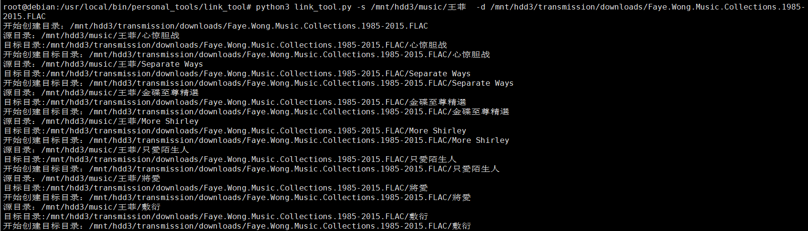
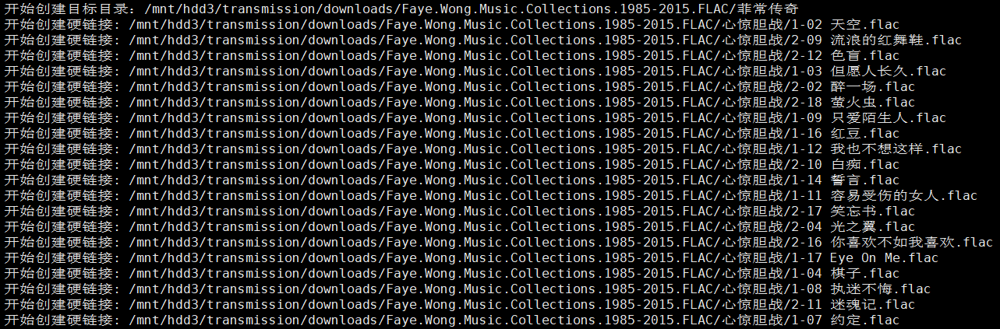

# 目录硬链接创建工具

### 更新

经[xuewenG](https://github.com/xuewenG) 提醒，使用`cp -r -l [src_dir] [dst_dir]` 可以达到同样的效果，我自己测试了一把通过。

```shell
-l, --link                   hard link files instead of copying
```

本项目就作为一个`os.walk()`和`click`的demo项目得了

​																																	——2020年3月19日09点59分

## 目的

目录硬链接创建工具。由于Linux 硬链接不支持目录，使用遍历创建目录，然后给文件创建硬链接。

## 使用场景

用来给PT做种，不想移动原文件，又不想拷贝一份占用磁盘空间。创建软链接无法进行辅种，创建硬链接可以辅种，但是无法创建目录的硬链接。
现在想要做一个工具，给目录创建硬链接，遇到目录的时候创建目录，遇到文件进行硬链接创建

## 用法

```shell
python3 link_tool.py -s <src dir> -d <dst dir>
```




